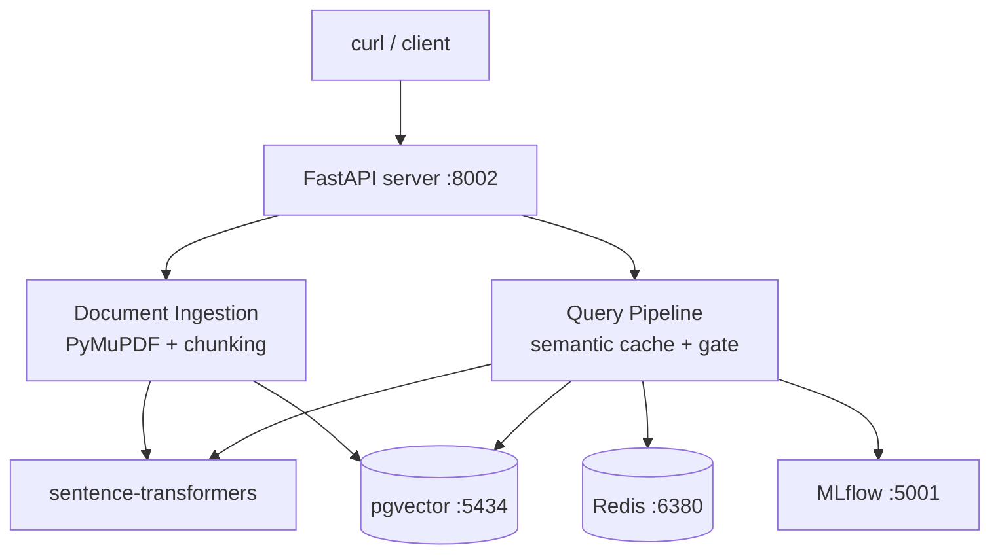

<div align="center">
  

  <p><strong>A production-grade RAG backend for enterprise knowledge retrieval with LLMOps capabilities.</strong></p>

  <p>
    
    
    
    
    
    
    
  </p>
</div>

## Overview

Nexus Knowledge Engine is a **backend-only** RAG system. Upload PDFs → extract text → generate embeddings → store in pgvector → query with semantic caching + retrieval gate safety + MLflow telemetry.

## Architecture



## Quick Start

```bash
make dev-up                    # Build + start + seed data
make logs-dev                  # Tail logs
```

| Service | URL |
|---------|-----|
| API (Swagger) | http://localhost:8002/docs |
| pgAdmin | http://localhost:5051 |
| MLflow | http://localhost:5001 |

## API Endpoints

| Method | Path | Description |
|--------|------|-------------|
| `GET` | `/health` | Health check |
| `POST` | `/documents/upload` | Upload PDF → extract → chunk → embed → store |
| `POST` | `/query` | Ask a question (with caching + safety gate) |
| `GET` | `/metrics` | System stats (total queries, avg time, gate block rate) |

## Features

### Phase 1 — Core Backend & Vector Storage
- **PDF Ingestion**: PyMuPDF text extraction → sliding window chunking (1000 chars, 200 overlap) → sentence-transformers embeddings (384-d) → pgvector HNSW index
- **Vector Search**: Cosine similarity via `<=>` operator with configurable threshold (default 0.6)
- **Idempotent Uploads**: Re-uploading the same filename replaces old chunks + re-embeds

### Phase 2 — LLMOps & Production Safety
- **Semantic Caching**: Two-level Redis cache — exact hash + embedding-based (cosine >= 0.95)
- **Retrieval Gate**: Blocks responses with confidence < 0.5 or no chunks; tracks block rate
- **MLflow Telemetry**: Logs latency, confidence, sources_count, errors, and gate events per query

## Project Structure

```
nexus/
  backend/
    app/
      core/config.py          — Settings: DB, Redis, MLflow, thresholds
      llm/
        document_ingestion.py — PDF → text → chunks → embeddings → pgvector
        vector_embedding.py   — Embedding generation + HNSW search + Redis caching
        query_processing.py   — Query pipeline: cache → search → gate → answer → MLflow
        retrieval_gate.py     — Safety gate: confidence check + block rate stats
      ml/
        mlflow_client.py      — MLflow wrapper (graceful connection handling)
      main.py                 — FastAPI app: startup, routes, middleware
    scripts/
      seed_test_data.sql      — Idempotent demo data seeder
      generate_test_pdf.py    — Pure-Python PDF generator for testing
  docs/
    architecture/             — Mermaid flow diagrams per feature
    phase/                    — Phase-by-phase implementation guides
    api/, deployment/, development/
  docker-compose.dev.yml      — Dev stack (pgvector, Redis, pgAdmin, API)
  docker-compose.prod.yml     — Production stack (+ MLflow)
  Makefile                    — dev-up, dev-down, logs-dev, dev-seed
```

## Configuration

| Param | Default | Description |
|-------|---------|-------------|
| `similarity_threshold` | 0.6 | Min cosine sim for chunk inclusion |
| `semantic_cache_threshold` | 0.95 | Min cos sim for semantic cache hit |
| `retrieval_gate_min_confidence` | 0.5 | Min confidence to pass the gate |
| `chunk_size` | 1000 | Sliding window chunk size (words) |
| `chunk_overlap` | 200 | Overlap between chunks |
| `semantic_cache_ttl` | 3600 | Redis TTL for cache entries |

## Testing

```bash
# Upload a PDF
curl -X POST http://localhost:8002/documents/upload \
  -F "file=@backend/tests/test_document.pdf"

# Query the knowledge base
curl -X POST http://localhost:8002/query \
  -H "Content-Type: application/json" \
  -d '{"question": "What is the Nexus Knowledge Engine?"}'

# Check metrics
curl http://localhost:8002/metrics

# Verify DB state
docker exec nexus-vector-db psql -U admin -d nexus_knowledge \
  -c "SELECT id, filename FROM documents;"
```

## Documentation

| Doc | Content |
|-----|---------|
| `docs/architecture/system-architecture.md` | System overview with Mermaid diagram |
| `docs/architecture/document-ingestion.md` | PDF ingestion flow |
| `docs/architecture/query-processing.md` | Query pipeline flow |
| `docs/architecture/semantic-caching.md` | Redis cache hierarchy |
| `docs/architecture/retrieval-gate.md` | Safety gate + metrics |
| `docs/phase/testing-guide.md` | Step-by-step endpoint verification |
