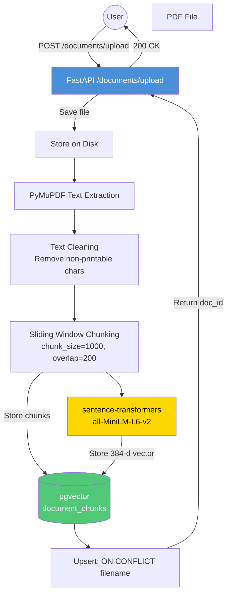

# Document Ingestion Pipeline

## Key Details

| Step | Technology | Notes |
|------|-----------|-------|
| Text Extraction | PyMuPDF (`fitz`) | Extracts text from all PDF pages |
| Text Cleaning | Custom `str.isprintable()` filter | Strips U+FFFD replacement chars while preserving `\n\r\t` |
| Chunking | Sliding Window | Words-based, configurable `chunk_size` and `chunk_overlap` |
| Embedding | `sentence-transformers/all-MiniLM-L6-v2` | 384-dimensional vectors |
| Storage | pgvector | HNSW index with `vector_cosine_ops` |
| Idempotency | `ON CONFLICT (filename) DO UPDATE` | Re-uploading the same file replaces chunks + re-embeds |
