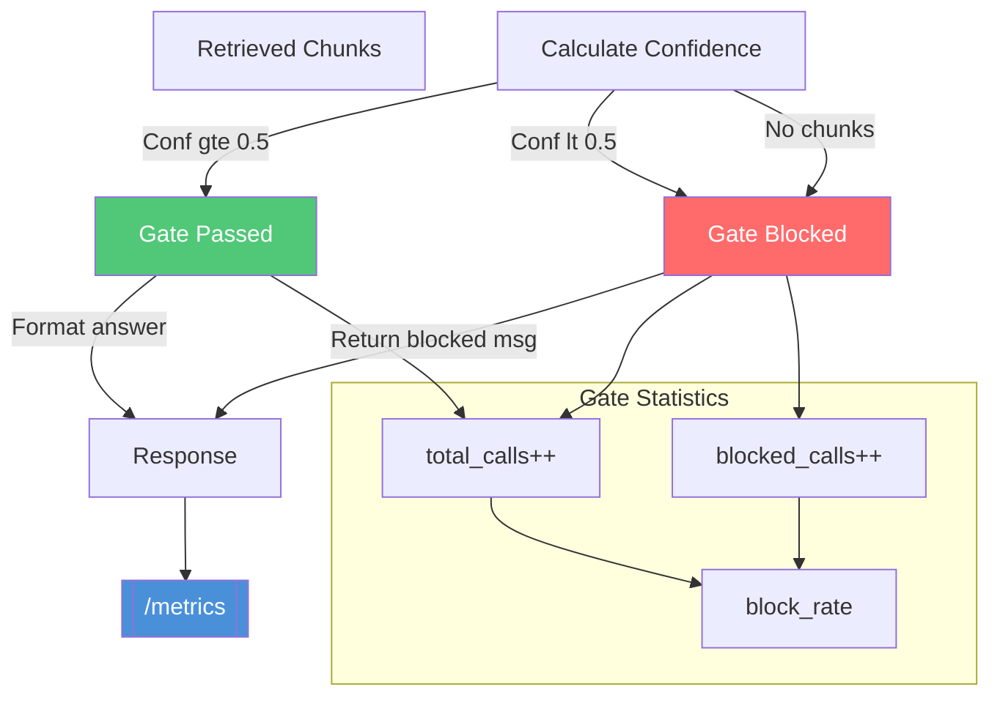

# Retrieval Gate



## Configuration

| Parameter | Value | Description |
|-----------|-------|-------------|
| `min_confidence` | 0.5 | Minimum confidence to allow answer |
| `similarity_threshold` | 0.6 | Minimum cosine similarity for chunk inclusion |

## /metrics Response

```json
{
  "total_queries": 10,
  "average_response_time": 0.023,
  "error_rate": 0.3,
  "average_confidence": 0.45,
  "retrieval_gate": {
    "total_calls": 10,
    "blocked_calls": 3,
    "block_rate": 0.3
  }
}
```
