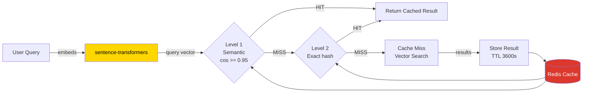

# Semantic Caching



## Cache Hierarchy

| Level | Key Pattern | Lookup | Threshold |
|-------|------------|--------|-----------|
| 1 — Semantic | `semantic_cache:<hash>` | Cosine similarity against stored query embeddings | >= 0.95 |
| 2 — Exact | `search:<hash(query)>:<top_k>` | Exact string match | Exact |
| Query Result | `query:<hash(query)>` | Exact string match (full result) | Exact |

## Redis Keys

```
search:-649191163085575582:5      → vector search results for query hash + top_k
query:-649191163085575582         → full query response (answer + sources)
semantic_cache:-8378896101063663074 → query embedding + results for semantic matching
```
