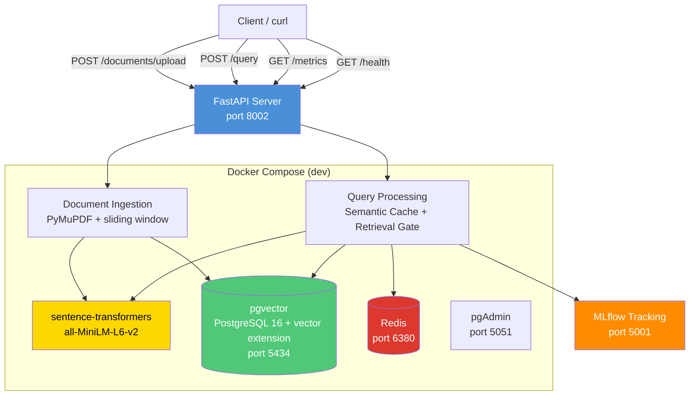

# System Architecture

## Container Summary

| Service | Image | Internal Port | Host Port | Purpose |
|---------|-------|---------------|-----------|---------|
| `api` | `nexus-api` | 8000 | 8002 | FastAPI application |
| `vector-db` | `ankane/pgvector` | 5432 | 5434 | PostgreSQL + vector extension |
| `redis` | `redis:7-alpine` | 6379 | 6380 | Caching (semantic + exact) |
| `pgadmin` | `dpage/pgadmin4` | 80 | 5051 | Database admin UI |

## Data Flow

1. **Document Upload**: PDF → PyMuPDF text extraction → cleaning → sliding-window chunking → sentence-transformers embedding → pgvector storage
2. **Query**: JSON question → embedding → 2-level Redis cache check (semantic + exact) → pgvector HNSW cosine search → dedup → confidence calc → Retrieval Gate → formatted answer → MLflow telemetry
3. **Production**: Add `docker-compose.prod.yml` with MLflow, load balancer, and non-reload uvicorn
