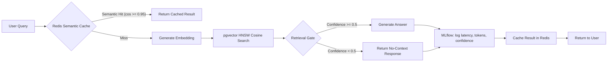

# Phase 2: LLMOps & Production Safety

## Overview

Phase 2 adds production safety layers and observability: semantic caching to reduce costs, a retrieval gate to prevent hallucinations, and MLflow telemetry for full query lifecycle tracking.

## Architecture Flow



## Day-by-Day Breakdown

### Days 8-9: Semantic Caching via Redis

**Files:** `backend/app/llm/vector_embedding.py`

#### Problem
Exact hash-based caching (`hash(query)`) only catches identical queries. Similar questions like "What is this system?" and "What does this system do?" miss the cache, wasting embedding computation.

#### Solution — Two-Level Caching

**Level 1 — Semantic Cache:**
- Each query is embedded using `sentence-transformers/all-MiniLM-L6-v2`
- The embedding is stored in Redis as `semantic_cache:<hash>` with:
  - The embedding vector
  - The search results (chunks + scores)
  - Timestamp
- On new query: generate its embedding, scan stored semantic cache entries, compute cosine similarity
- If similarity >= `0.95`, return cached results — **even for differently-worded queries**

**Level 2 — Exact Cache:**
- Backward-compatible hash-based cache as fallback
- Key: `search:{hash(query)}:{top_k}`

```python
async def _check_semantic_cache(self, query_embedding, threshold):
    """Scan Redis for semantically similar past queries."""
    for key in await self.redis_client.keys("semantic_cache:*"):
        entry = json.loads(await self.redis_client.get(key))
        sim = cosine_similarity(query_embedding, entry["embedding"])
        if sim >= threshold:
            return entry["results"]
    return None
```

#### Configuration

```python
# backend/app/core/config.py
semantic_cache_threshold: float = 0.95  # Min cosine for a semantic hit
semantic_cache_ttl: int = 3600          # Cache expiry (seconds)
```

---

### Days 10-11: Retrieval Gate

**File:** `backend/app/llm/retrieval_gate.py`

#### Problem
When no relevant context is found, the LLM may hallucinate an answer. A safety gate must block low-confidence responses.

#### Solution

A `RetrievalGate` class sits between vector search and answer generation:

```python
class RetrievalGate:
    def evaluate(self, chunks, confidence) -> GateDecision:
        # 1. No chunks found → BLOCK
        # 2. Confidence below threshold → BLOCK
        # 3. Passes → ALLOW
```

**Decision outcomes:**

| Scenario | Confidence | Result |
|---|---|---|
| No chunks retrieved | 0.0 | ❌ Blocked — "No relevant context found" |
| Confidence < 0.5 | 0.3 | ❌ Blocked — "Confidence too low" |
| Confidence >= 0.5 | 0.85 | ✅ Passed — generate answer |

**Monitoring:**
- `gate.get_stats()` returns `total_calls`, `blocked_calls`, `block_rate`
- Exposed via `GET /metrics` endpoint

```json
{
  "retrieval_gate": {
    "total_calls": 150,
    "blocked_calls": 12,
    "block_rate": 0.08
  }
}
```

---

### Days 12-14: MLflow Telemetry

**Files:**
- `backend/app/ml/mlflow_client.py`
- `backend/app/llm/query_processing.py`
- `backend/app/main.py`

#### Problem
No observability into query performance, error rates, or retrieval gate events.

#### Solution

Every query is logged to MLflow with:

| Metric | Description |
|---|---|
| `response_time` | Latency in seconds |
| `confidence` | Cosine similarity confidence |
| `sources_count` | Number of context chunks used |
| `error` | 1 if query failed or was blocked |

**Retrieval gate events** are logged as separate MLflow runs under `retrieval_gate_blocked`:

| Parameter | Description |
|---|---|
| `gate_confidence` | The confidence that failed |
| `gate_threshold` | Minimum threshold |
| `gate_reason` | Why it was blocked |

**Startup wiring** in `main.py`:

```python
mlflow_client = MLflowClient()

query_pipeline = QueryProcessingPipeline(
    ...,
    mlflow_client=mlflow_client,
)
```

#### MLflow Dashboard

Access at `http://localhost:5001` to:
- View per-query latency and confidence
- Track retrieval gate block events
- Compare performance across query categories
- Export run data for analysis

---

## Configuration

New settings in `backend/app/core/config.py`:

| Variable | Default | Phase |
|---|---|---|
| `semantic_cache_threshold` | `0.95` | Day 8-9 |
| `semantic_cache_ttl` | `3600` | Day 8-9 |
| `retrieval_gate_min_confidence` | `0.5` | Day 10-11 |

## Running

```bash
# MLflow container must be running for telemetry
docker compose -f docker-compose.dev.yml --env-file .env.dev up -d
# MLflow UI: http://localhost:5001
```

## Verification

```bash
# Test retrieval gate (no context = blocked)
curl -X POST http://localhost:8002/query \
  -H "Content-Type: application/json" \
  -d '{"question": "Something not in the database"}'

# Expected: blocked response with reason

# Check gate stats
curl http://localhost:8002/metrics
# Expected: retrieval_gate.total_calls, blocked_calls, block_rate
```
