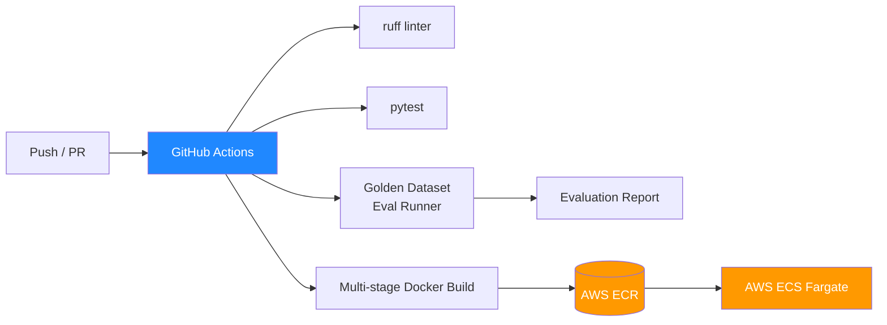

# Phase 3: CI/CD & MLOps Infrastructure (Days 15-21)



## Days 15-17: Golden Dataset & Evaluation

### Golden Dataset

Created `data/golden_dataset.json` with 15 test cases across categories:

| Category | Count | Purpose |
|----------|-------|---------|
| exact_match | 4 | Direct Q&A from document content |
| semantic_similar | 4 | Paraphrased questions |
| no_context | 3 | Questions with no match (gate test) |
| edge_case | 3 | Empty, minimal, partial query |
| mixed | 1 | Regression / cross-document |

### Evaluation Runner

Script: `backend/scripts/run_evaluation.py`

```bash
python backend/scripts/run_evaluation.py
```

Evaluates each test case against the live API and checks:
- Answer contains expected phrases
- Sources count matches expectations
- Retrieval Gate blocks/no-blocks correctly
- Confidence meets minimum threshold
- Response time is within limits

Output:
```
  Smoke Tests:       4/4 (100%)
  Semantic Tests:    1/4 (25%)    ← expected before LLM integration
  Gate Tests:        3/3 (100%)
  Edge Cases:        2/3 (67%)
```

Reports saved to `data/evaluations/eval_report_{timestamp}.json`.

### Pytest Suite

```
backend/tests/
  conftest.py           — Shared fixtures
  test_health_upload.py — Health + upload endpoint tests
  test_query.py         — Query, caching, gate, metrics tests
```

```bash
make test
# or
cd backend && python -m pytest tests/ -v --cov=app --cov-fail-under=80
```

## Days 18-19: GitHub Actions

File: `.github/workflows/ci.yml`

**Trigger:** PR to `develop` or `main`, push to `develop`

**Pipeline stages:**

1. **Lint** — ruff on `backend/app/` and `backend/scripts/`
2. **Test & Coverage** — Start Docker compose → seed data → upload test doc → run pytest with `--cov-fail-under=80` → run golden dataset eval → archive report → cleanup

**Coverage gate:** If coverage falls below **80%**, the CI step fails and the PR cannot merge.

**Key env vars:** `NEXUS_API_URL=http://localhost:8002`

## Days 20-21: Multi-stage Docker & AWS Deploy

> **Note:** AWS ECR/ECS deployment is on hold. Only the multi-stage Dockerfile is in place.

### Multi-stage Dockerfile

`backend/Dockerfile.prod` now uses two stages:

| Stage | Base | Contents | Size |
|-------|------|----------|------|
| `builder` | `python:3.11-slim` | gcc/g++, pip install, virtual env | ~1.2GB |
| `runtime` | `python:3.11-slim` | libgomp1, venv from builder, source only | ~400MB |

Build:
```bash
docker build -f backend/Dockerfile.prod -t nexus-api:latest backend/
```

### Makefile Targets

| Target | Description |
|--------|-------------|
| `make test` | Run pytest with coverage gate (80%) |
| `make eval` | Run golden dataset evaluation |
| `make build-prod` | Build multi-stage production image |
